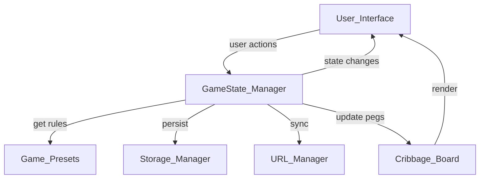

# Scoreboard - AI Development Documentation

## Project Overview

An advanced, multi-game scoreboard application with dynamic player management, game-specific logic and visualizations, persistent state management, and preparation for real-time multiplayer functionality.

## Architecture

### System Design



### File Structure & Responsibilities

```
scoreboard/
├── index.html              # DOM structure, modal UI
├── styles.css              # Theming system, responsive layouts
├── script.js               # Core app logic, GameState class, UI rendering
├── games.js                # Game configurations and rule logic
├── cribbage-board.js       # SVG board rendering and peg animation
├── url-manager.js          # URL serialization/deserialization
├── storage-manager.js      # localStorage persistence
├── DATABASE_PLAN.md        # Future Firebase/Supabase integration
├── README.md               # User documentation
└── AI_DOCS.md              # This file
```

## Core Architecture

### GameState Class (script.js)

Central state management using the Observer pattern:

```javascript
class GameState {
  // State
  players: Array<Player>
  gameMode: 'custom' | 'pooch' | 'cribbage'
  settings: Settings
  currentRound: number
  rounds: Array<RoundData>
  
  // Observer pattern
  observers: Array<Function>
  subscribe(callback)
  notify()
  
  // Player management
  addPlayer(name?)
  removePlayer(playerId)
  updatePlayer(playerId, updates)
  updatePlayerScore(playerId, delta)
  setPlayerScore(playerId, score)
  
  // Game management
  setGameMode(mode)
  updateSettings(newSettings)
  updateRoundData(playerId, round, data)
  resetGame()
  
  // Persistence
  persistState()
  toJSON()
  fromJSON(data)
}
```

**Observer Pattern Implementation:**
- UI components subscribe to state changes
- Any state mutation triggers `notify()`
- All subscribed callbacks receive updated state
- Automatic re-render on every change

**Persistence Strategy:**
- Changes debounced (500ms) before saving to localStorage
- URL updated on every change (300ms debounce)
- Priority: URL params → localStorage → defaults

### Game Presets System (games.js)

Modular game configurations with both UI layout and business logic:

```javascript
const GAME_PRESETS = {
  custom: {
    name: string
    columns: Array<string>
    logic: null
  },
  pooch: {
    name: string
    columns: Array<string>
    maxRounds: number
    roundCards: Array<number>
    logic: {
      calculateScore: (bid, tricks) => number
      validateBid: (round) => {min, max}
      validateTricks: (round) => {min, max}
    }
  },
  cribbage: {
    name: string
    columns: Array<string>
    winScore: number
    visualize: 'board'
    logic: {
      renderBoard: boolean
      calculatePosition: (score) => number
      checkWin: (score) => boolean
    }
  }
}
```

**Adding New Games:**

1. Add configuration to `GAME_PRESETS` object
2. Implement rendering logic in `script.js` → `renderPlayers()`
3. Add any special visualization (like cribbage board)
4. Update settings modal if game-specific settings needed

### URL Parameter Management (url-manager.js)

**Serialization Format:**
```
?game=pooch&players=Alice,Bob,Charlie&theme=dark&numRounds=10&showBids=true&showTricks=true&showDeal=true&showRounds=true
```

**Functions:**
- `serializeToURL(gameState)`: Convert state to query string
- `deserializeFromURL()`: Parse URL params to state object
- `updateURL(gameState, debounced)`: Update browser URL without reload

**State Loading Priority:**
1. URL parameters (highest priority - for sharing)
2. localStorage (for returning users)
3. Default values (new users)

### Storage Management (storage-manager.js)

**LocalStorage Strategy:**
- Single key: `'scoreboard_state'`
- JSON serialized state
- Auto-save debounced (500ms)
- Clear history option in settings

**Data Persistence:**
- Full game state saved (players, scores, settings, round data)
- URL params saved separately (for sharing)
- Automatic sync on every state change

### Cribbage Board (cribbage-board.js)

**SVG Board Structure:**
- 121 holes in "S" pattern
- 4 rows of 30 holes each + finish hole
- Row 1 (0-30): left → right, top
- Row 2 (31-60): right → left, upper-mid
- Row 3 (61-90): left → right, lower-mid
- Row 4 (91-120): right → left, bottom
- Hole 121: center finish

**Peg System:**
- 2 pegs per player (front and back)
- Color-coded per player (10 distinct colors)
- CSS transitions for smooth movement
- Offset positioning for multiple players on same hole

**Functions:**
- `renderCribbageBoard(players)`: Creates SVG board with all pegs
- `updateCribbagePegs(players)`: Animates pegs to new positions

## UI Rendering System

### Dynamic Rendering

Three main rendering functions based on game mode:

1. **`renderCustomPlayers(state, container)`**
   - CSS Grid layout (auto-fit, responsive)
   - Player cards with name, score, +/- buttons
   - Inline name editing
   - Delete buttons

2. **`renderPoochTable(state, container, preset)`**
   - HTML table with rounds as columns
   - Header row shows round number and card count
   - Each cell has bid/tricks inputs
   - Auto-calculate scores on input change
   - Running total column

3. **`renderCribbagePlayers(state, container)`**
   - SVG board visualization
   - Player control panels below board
   - Multiple score increment options (+1, +2, +5)
   - Real-time peg updates

### Event Delegation

Single event listener on `#players-container` handles all player interactions:

```javascript
// Click events: score buttons, delete buttons
handlePlayerContainerClick(e)

// Input events: name editing
handlePlayerContainerInput(e)

// Change events: bid/tricks inputs
handlePlayerContainerChange(e)
```

**Benefits:**
- Efficient (single listener vs many)
- Works with dynamically added elements
- Clean event management

## Theming System

### CSS Custom Properties

Four themes defined with CSS variables:

```css
[data-theme="purple"] { --primary: #667eea; ... }
[data-theme="blue"]   { --primary: #3498db; ... }
[data-theme="green"]  { --primary: #2ecc71; ... }
[data-theme="dark"]   { --primary: #2d3748; ... }
```

**Theme Application:**
- `data-theme` attribute on document root
- All colors reference CSS variables
- Instant theme switching
- Dark mode uses inverted text colors

**Adding New Themes:**
1. Add `[data-theme="name"]` block in CSS
2. Define all required variables
3. Add option to settings modal `<select>`

## Responsive Design Strategy

### Breakpoints

- **1200px**: Reduce player card minimum width
- **768px**: Stack to single column, vertical game modes
- **480px**: Further size reductions for small phones

### Techniques

- CSS Grid with `auto-fit` for flexible columns
- `overflow-x: auto` for Pooch table on mobile
- Modal becomes full-screen on mobile
- Touch-friendly button sizes (min 44x44px)

## Game Logic

### Pooch (Oh, Shit) Scoring

```javascript
calculateScore(bid, tricks) {
  if (bid === tricks) {
    return bid + 10;  // Made your bid
  }
  return -Math.abs(bid - tricks) * 2;  // Penalty
}
```

**Round Structure:**
- 10 rounds (configurable)
- Cards per round: [10, 9, 8, 7, 6, 5, 4, 3, 2, 1]
- Players enter bid, then tricks after round
- Score auto-calculates and adds to total

**Data Structure:**
```javascript
player.roundData = {
  1: { bid: 5, tricks: 5, score: 15 },
  2: { bid: 4, tricks: 3, score: -2 },
  // ...
}
```

### Cribbage Logic

- Traditional 121-point game
- Pegs move automatically on score update
- Front/back peg system (leapfrog scoring)
- Board visualization updates in real-time

## Settings System

### Settings Modal

- Overlay with backdrop blur
- Slide-in animation
- Click-outside-to-close
- Form-based settings

### Available Settings

```javascript
settings: {
  colorTheme: 'purple' | 'blue' | 'green' | 'dark',
  showRounds: boolean,
  numberOfRounds: number,
  showBids: boolean,
  showTricks: boolean,
  showDeal: boolean
}
```

### State Flow

1. Open modal → populate with current settings
2. User modifies → validate inputs
3. Save → update `gameState.settings`
4. `notify()` → UI re-renders with new settings
5. Auto-save to localStorage and URL

## Performance Considerations

### Debouncing

- **localStorage save**: 500ms debounce
- **URL updates**: 300ms debounce
- Prevents excessive writes during rapid changes

### Efficient Rendering

- Only re-render on actual state changes
- CSS animations use `transform` (GPU-accelerated)
- Event delegation reduces listeners
- Minimal DOM manipulation

### Memory Management

- No memory leaks (no unbounded arrays)
- Event listeners cleaned up properly
- Debounce timers cleared on updates

## Testing Checklist

### Player Management
- [ ] Add player (up to 10)
- [ ] Remove player (minimum 2)
- [ ] Edit player name inline
- [ ] Name persists after edit

### Scoring
- [ ] +1, -1, +5 buttons work
- [ ] Score animations trigger
- [ ] Negative scores prevented (stay at 0)
- [ ] Scores persist on reload

### Game Modes
- [ ] Switch between Custom/Pooch/Cribbage
- [ ] Layouts change appropriately
- [ ] Scores reset on mode change
- [ ] Confirmation dialog appears

### Pooch Game
- [ ] Bid and tricks inputs work
- [ ] Scores calculate correctly
- [ ] Total updates automatically
- [ ] All rounds accessible
- [ ] Input validation (max cards per round)

### Cribbage
- [ ] Board renders with all holes
- [ ] Pegs appear for all players
- [ ] Pegs move smoothly on score change
- [ ] Multiple players visible on same hole
- [ ] Front/back peg system works

### Settings
- [ ] Modal opens and closes
- [ ] All settings save
- [ ] Theme changes apply immediately
- [ ] URL updates with settings
- [ ] localStorage saves settings

### Persistence
- [ ] Game state saves to localStorage
- [ ] URL params update on changes
- [ ] Reload from URL works
- [ ] Reload from localStorage works
- [ ] Clear history works

### Responsive
- [ ] Works on desktop (1920x1080)
- [ ] Works on tablet (768x1024)
- [ ] Works on mobile (375x667)
- [ ] Touch targets adequate size
- [ ] No horizontal scroll (except Pooch table)

### Sharing
- [ ] URL contains all game state
- [ ] Opening shared URL restores state
- [ ] Players and settings preserved

## Common Modifications

### Add New Score Button

In `renderCustomPlayers()`:

```javascript
<button class="score-btn" data-player-id="${player.id}" data-delta="10">+10</button>
```

### Change Pooch Rounds

Update in `games.js`:

```javascript
pooch: {
  maxRounds: 15,
  roundCards: [15, 14, 13, ... 1]
}
```

### Add New Setting

1. Add to `GameState` settings object
2. Add input to settings modal HTML
3. Update `openSettings()` to populate
4. Update `saveSettings()` to save
5. Add to URL serialization

### Customize Player Colors

In `cribbage-board.js`:

```javascript
const PLAYER_COLORS = [
  '#your-color-1',
  '#your-color-2',
  // ...
];
```

## Future Database Integration

See `DATABASE_PLAN.md` for comprehensive multiplayer plan.

**Summary:**
- Firebase Realtime Database recommended
- 4-hour implementation estimate
- No backend code required
- Real-time sync across devices
- Room codes for joining games

**Integration Points:**
1. Add Firebase SDK
2. Create `firebase-sync.js` module
3. Modify `GameState.notify()` to sync
4. Add game creation/joining UI
5. Update URL structure for room codes

**Code Changes Required:**
- Minimal! Observer pattern already supports this
- Add `syncEnabled` flag to GameState
- `notify()` syncs to Firebase instead of localStorage
- `fromJSON()` accepts remote updates

## Development Workflow

### Local Development

1. Open `index.html` in browser
2. Edit files
3. Refresh to see changes
4. Check console for errors

### Debugging

- Use Chrome DevTools
- Check localStorage: Application → Local Storage
- Inspect URL params in address bar
- Watch console for state changes
- Use React DevTools or similar for state inspection

### Adding Features

1. Update `GameState` class if state changes
2. Add rendering logic to appropriate function
3. Update CSS for new elements
4. Add settings if configurable
5. Update URL serialization if needed
6. Test across breakpoints

## Best Practices

### State Management
- Always use `gameState` methods to modify state
- Never mutate `gameState` properties directly
- Use observer pattern for UI updates
- Keep business logic in `games.js`

### UI Updates
- Let `notify()` trigger renders
- Don't manually update DOM outside renders
- Use event delegation for dynamic content
- Animate with CSS, not JavaScript

### Performance
- Debounce expensive operations
- Use CSS transforms for animations
- Minimize DOM queries
- Batch state updates when possible

### Maintainability
- Keep functions small and focused
- Comment complex logic
- Use descriptive variable names
- Separate concerns (state vs UI vs persistence)

## Troubleshooting

### State Not Persisting
- Check localStorage in DevTools
- Verify `persistState()` is called
- Check debounce timing
- Clear localStorage and try again

### URL Not Updating
- Check `updateURL()` is called
- Verify debounce timing
- Check browser history permissions
- Try without debounce

### Cribbage Board Not Rendering
- Check SVG creation in console
- Verify `renderCribbageBoard()` is called
- Check container exists in DOM
- Inspect SVG element in DevTools

### Pooch Scores Wrong
- Verify `calculateScore()` logic
- Check bid and tricks are numbers
- Inspect `roundData` object
- Test calculation manually

### Theme Not Applying
- Check `data-theme` attribute on root
- Verify CSS variables defined
- Check theme name matches CSS selector
- Try clearing cache

## Deployment

### Static Hosting Options
- GitHub Pages (free)
- Netlify (free tier)
- Vercel (free tier)
- Cloudflare Pages (free)

### Deployment Steps
1. Push to GitHub
2. Enable GitHub Pages in settings
3. Select branch and folder
4. Visit provided URL

**No build process needed** - it's all static files!

## Contributing Guidelines

### Code Style
- Use ES6+ features
- Prefer `const` over `let`
- Use template literals for strings
- Comment non-obvious logic
- Keep functions pure when possible

### Git Workflow
- Commit atomic changes
- Write descriptive commit messages
- Test before committing
- Don't commit commented-out code

### Documentation
- Update README for user-facing changes
- Update AI_DOCS for architectural changes
- Add JSDoc comments for complex functions
- Keep DATABASE_PLAN.md updated

## Conclusion

This scoreboard application demonstrates:
- Clean separation of concerns
- Modular, extensible architecture
- Modern vanilla JavaScript patterns
- Responsive, accessible design
- Preparation for real-time features

The codebase is designed to be easily maintainable and extensible, with clear patterns for adding new games, themes, and features. The future database integration will require minimal changes thanks to the observer pattern and centralized state management.

**Happy coding!** 🎮
